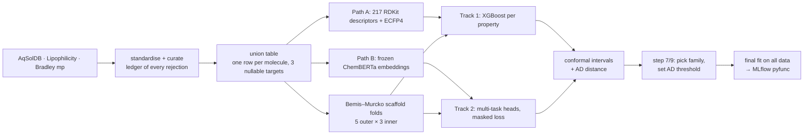

# dupont-qspr

A small-molecule property predictor. Give it SMILES strings and it returns, for
each molecule:

| Property | What it is | Units |
|---|---|---|
| `logS` | aqueous solubility | log mol/L |
| `logP` | lipophilicity (measured as logD at pH 7.4) | log units |
| `mp_K` | melting point | K |

Each prediction comes with a **calibrated 90% prediction interval** and an
**applicability-domain flag**, which says whether the molecule resembles the
training data closely enough for the interval to be trusted. The model ships as a
versioned MLflow pyfunc.

The design is fixed in [`qspr_project_brief.md`](qspr_project_brief.md). This
README covers what was built, how to run it, and where the build departs from the
brief.

---

## What it returns

```text
$ uv run dupont-qspr --profile smoke "CC(=O)Oc1ccccc1C(=O)O" "not a molecule"
```

```json
{
  "smiles_canonical": "CC(=O)Oc1ccccc1C(=O)O",
  "predictions": {
    "logS": {"value": -1.78, "lower": -6.00, "upper": 0.13, "nominal_coverage": 0.9},
    "logP": {"value":  1.82, "lower":  0.16, "upper": 3.87, "nominal_coverage": 0.9},
    "mp_K": {"value": 431.4, "lower": 257.1, "upper": 499.7, "nominal_coverage": 0.9}
  },
  "applicability_domain": {"nn_tanimoto_distance": 0.33, "in_domain": true},
  "model_version": "xgb-smoke-1ed6346-20260914",
  "featurizer_version": "v1:rdkit-ecfp4"
}
{"smiles_input": "not a molecule", "error": "rejected: unparseable (not a molecule)", "predictions": null}
```

The values above come from the `smoke` profile (500 molecules, 3 tuning trials),
which exists to prove the pipeline end to end, so they are not meaningful
predictions. Reported numbers come from the `full` profile only. A bad input
produces an error record in its place, so one bad SMILES never costs the rest of
the batch.

---

## How it works



Five design decisions carry most of the weight:

- **Scaffold splits.** Test molecules never share a ring system with training
  molecules. A random split lets near-duplicates leak into the test set and makes
  the model look better than it will be on genuinely new chemistry.
- **Nested cross-validation.** Hyperparameters are searched on the inner folds
  only, and the outer test fold is scored once. The result estimates how well the
  *whole procedure* performs, search included. The shipped model is a separate
  final fit on all of the data.
- **Two model families on identical folds.** Per-property XGBoost is the baseline
  everything must beat. The multi-task model tests whether properties sharing one
  representation helps, especially when labels are scarce.
- **Conformal calibration.** Raw uncertainty (XGBoost quantile regression, or
  deep-ensemble spread) sets the *shape* of each interval. Conformal calibration
  on out-of-fold residuals sets the *width*, so 90% intervals cover about 90% of
  true values.
- **Applicability domain from the error curve.** Error is plotted against each
  molecule's Tanimoto distance to its nearest training neighbour. The threshold is
  the distance at which error measurably climbs, rather than a guessed constant.

---

## Running it

Requires [uv](https://docs.astral.sh/uv/) and, on macOS, `brew install libomp`.

```sh
uv sync
experiments/run_pipeline.sh smoke   # every stage end to end, about a minute
experiments/run_pipeline.sh full    # the reported run
```

Every stage is its own script under `experiments/` and takes
`--profile {smoke,dev,full}`. Each stage reads what the previous one persisted,
so a stage can be rerun alone. They must run as separate processes: XGBoost and
PyTorch link different OpenMP runtimes and crash when loaded together.

| Stage | Script | Full-profile cost |
|---|---|---|
| Data, features, folds | `01`–`03` | minutes (encoders embed about 1,750 molecules/s) |
| XGBoost nested search | `04_nested_xgb.py` | ~3 h, measured |
| Multi-task nested search, both encoders | `06_nested_mtl.py` | ~2 h, measured |
| Conformal intervals + AD distances | `08_uncertainty.py` | ~40 min, measured |
| Family choice, coverage by distance, AD threshold | `07_analyze.py` | seconds |
| Low-data ablation | `10_ablation.py` | minutes, estimated from fit times |
| Final search, calibration, MLflow registration | `11_final_fit.py` | ~1–2 h for XGBoost, estimated |

Tests run as **two invocations**, split on the same OpenMP boundary:

```sh
uv run pytest --ignore=tests/torch_runtime && uv run pytest tests/torch_runtime
```

Loading the registered model directly:

```python
import mlflow.pyfunc

mlflow.set_tracking_uri("sqlite:///artifacts/full/mlflow.db")
model = mlflow.pyfunc.load_model("models:/dupont-qspr-oracle/latest")
records = model.predict(["CCO", "c1ccccc1O"])
```

---

## Where it departs from the brief

These are deliberate, and each would be raised in a design review.

1. **One model family ships, not a per-property hybrid.** The brief allows a
   different winner for each property. XGBoost and the transformer encoder cannot
   share a process on this hardware, even when the encoder is loaded first, so
   the artifact carries the family that wins the most properties. Per-property
   winners are still reported.
2. **Family selection uses outer-fold scores.** This is a mild form of selection
   on held-out data. There are two candidates per property rather than fifty
   configurations, so the optimism is small, but it is not zero. Under a true
   tie, three 95% paired intervals will declare at least one spurious win about
   14% of the time. Ties go to XGBoost.
3. **Calibration is CV-recycled split conformal, not strict CV+/jackknife+.**
   Residuals come from inner-fold out-of-fold predictions. This keeps the
   calibration and test data disjoint without spending a separate calibration
   split, but it loses CV+'s formal finite-sample guarantee.
4. **The two tracks measure different kinds of uncertainty.** XGBoost quantile
   regression captures noise in the labels (aleatoric). Ensemble spread captures
   disagreement between models (epistemic). Both are then conformally calibrated
   to the same nominal coverage, but their interval shapes are not
   interchangeable.
5. **Quantile models reuse the point model's hyperparameters** rather than
   running a second search.
6. **Datasets come from primary sources, not PyTDC**, which cannot be installed
   alongside current numpy, pandas and RDKit. The benchmark scaffold splits were
   rebuilt locally, so the numbers do not compare directly with published leaderboards.
7. **ChemBERTa-2's tokenizer is broken** and reads `Cl` as `C` and `Br` as `B`.
   The model was pretrained that way, so the fix is not to patch the tokenizer
   but to cache a second encoder (`seyonec/PubChem10M_SMILES_BPE_450k`) with a
   working one, and compare the two.

## Honest limitations

- `logP` here is **logD at pH 7.4**, the quantity the Lipophilicity set measures.
  For ionisable molecules it differs from true logP.
- Melting-point labels have replicate spreads of several kelvin. That spread
  sets a floor on achievable error, and it is recorded rather than smoothed away.
- A single benzene-ring scaffold group holds 21% of molecules, so one outer fold
  is unavoidably larger and richer in melting points. Fold-to-fold variation is
  reported, not hidden.
- Tail Spearman is attenuated by restriction of range. It is reported alongside
  the enrichment factor, which ranks against the full list, and both tails are
  shown because the direction of interest depends on the use case.
- The applicability-domain flag says whether a molecule resembles the training
  set. It cannot say whether a prediction is correct.

---

## Layout

```text
src/dupont_qspr/
  contracts.py      the interfaces every stage meets at
  config.py         typed config; profiles overlay configs/base.yaml
  data/             download, standardise, curate, build the union table
  features/         descriptor + fingerprint cache, frozen-encoder cache
  splits/           scaffold assignment, nested fold allocation
  models/           XGBoost, multi-task heads, deep ensemble
  tuning/           Optuna search spaces, nested runs for each track
  uncertainty/      split conformal, CQR, applicability-domain index
  metrics/          point metrics, enrichment factor, baselines
  analysis/         step 7 comparison, step 9 coverage, step 10 ablation
  serving/          final fit, SMILES → scored record, MLflow pyfunc
  reporting/        tables and figures
experiments/        one script per pipeline stage, plus run_pipeline.sh
docs/               generated module dependency graph
```
