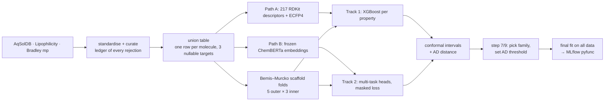

# QSPR Pipeline

A small-molecule property predictor. Give it SMILES strings and it returns, for
each molecule:

| Property | What it is | Units |
|---|---|---|
| `logS` | aqueous solubility | log mol/L |
| `logP` | lipophilicity (measured as logD at pH 7.4) | log units |
| `mp_K` | melting point | K |

Each prediction comes with a **calibrated 90% prediction interval** and an
**applicability-domain flag**, which says whether the molecule resembles the
training data closely enough for the interval to be trusted. The model ships as a
versioned MLflow pyfunc.

Intended use is high-volume batch scoring — screening a library, or feeding a
downstream optimiser in-process — not a low-latency endpoint. Generation,
multi-objective optimisation and synthesizability scoring are deliberately out of
scope.

The protocol was fixed before any modelling code was written, and the build ran in
eleven reviewed steps. Full results and method detail are in
[docs/REPORT.md](docs/REPORT.md).

---

## What it returns

```text
$ uv run dupont-qspr --profile smoke "CC(=O)Oc1ccccc1C(=O)O" "not a molecule"
```

```json
{
  "smiles_canonical": "CC(=O)Oc1ccccc1C(=O)O",
  "predictions": {
    "logS": {"value": -1.83, "lower":  -3.05, "upper":  -0.54, "nominal_coverage": 0.9},
    "logP": {"value": -0.29, "lower":  -1.59, "upper":   1.74, "nominal_coverage": 0.9},
    "mp_K": {"value": 393.4, "lower": 342.66, "upper": 467.96, "nominal_coverage": 0.9}
  },
  "applicability_domain": {"nn_tanimoto_distance": 0.0, "in_domain": true},
  "model_version": "xgb-full-6190d22-20260915",
  "featurizer_version": "v1:rdkit-ecfp4"
}
{"smiles_input": "not a molecule", "error": "rejected: unparseable (not a molecule)", "predictions": null}
```

A bad input produces an error record in its place, so one bad SMILES never costs
the rest of the batch.

---

## Results

From the reported `full` run: 29,404 molecules, 5 outer × 3 inner scaffold-disjoint
folds, 50 Optuna trials per study. Every number below is scored on held-out folds.

| Property | RMSE | RMSE ÷ SD | Spearman ρ | n |
|---|---|---|---|---|
| `logS` solubility | 0.97 ± 0.09 log units | **0.42** | 0.90 | 9,383 |
| `logP` lipophilicity | 0.69 ± 0.05 log units | **0.57** | 0.81 | 4,200 |
| `mp_K` melting point | 41.3 ± 1.6 K | **0.45** | 0.88 | 20,076 |

RMSE ÷ SD is the number to read: 1.0 means no better than predicting the mean, and
these sit comfortably below it. Melting point is the hardest of the three in
relative terms, as expected of a property governed by crystal packing.

**XGBoost won all three properties**, and the paired per-fold intervals excluded
zero in every case, so nothing came down to the tie-break. The multi-task track
reached 0.51 / 0.70 / 0.53 on the same folds. A shared representation over frozen
embeddings did not beat descriptors plus fingerprints here.

**The low-data ablation refutes the project's own hypothesis.** Multi-task was
expected to win when labels are scarce. It lost at every size from 100 to 1,000
labels per property, and for lipophilicity the gap widened as data grew
(−0.06 at 100, −0.15 at 1,000). Reported as measured.

**Intervals are calibrated but degrade with novelty.** Pooled coverage is 0.91
against a nominal 0.90. Split by distance to the nearest training molecule, it runs
0.94–0.95 for close analogues and 0.86–0.88 for the most novel decile — the exact
failure a pooled number hides. The applicability-domain threshold is 0.617, which
flags 13.5% of held-out molecules as out of domain.

**There is headroom.** Replicate disagreement in the source data is a median of
0.12 log units for solubility and 2 K for melting point, far below the errors
above, so the limit here is the model rather than the measurements.

Full detail: `artifacts/full/decision.json` and the figures in
`artifacts/full/figures/`.

---

## How it works



Five design decisions carry most of the weight:

- **Scaffold splits.** Test molecules never share a ring system with training
  molecules. A random split lets near-duplicates leak into the test set and makes
  the model look better than it will be on genuinely new chemistry.
- **Nested cross-validation.** Hyperparameters are searched on the inner folds
  only, and the outer test fold is scored once. The result estimates how well the
  *whole procedure* performs, search included. The shipped model is a separate
  final fit on all of the data.
- **Two model families on identical folds.** Per-property XGBoost is the baseline
  everything must beat. The multi-task model tests whether properties sharing one
  representation helps, especially when labels are scarce.
- **Conformal calibration.** Raw uncertainty (XGBoost quantile regression, or
  deep-ensemble spread) sets the *shape* of each interval. Conformal calibration
  on out-of-fold residuals sets the *width*, so 90% intervals cover about 90% of
  true values.
- **Applicability domain from the error curve.** Error is plotted against each
  molecule's Tanimoto distance to its nearest training neighbour. The threshold is
  the distance at which error measurably climbs, rather than a guessed constant.

---

## Running it

Requires [uv](https://docs.astral.sh/uv/) and, on macOS, `brew install libomp`.

```sh
uv sync
experiments/run_pipeline.sh smoke   # every stage end to end, about a minute
experiments/run_pipeline.sh full    # the reported run
```

Every stage is its own script under `experiments/` and takes
`--profile {smoke,dev,full}`. Each stage reads what the previous one persisted,
so a stage can be rerun alone. They must run as separate processes: XGBoost and
PyTorch link different OpenMP runtimes and crash when loaded together.

Wall-clock cost of the reported run, on an M4 Mac mini (10 cores):

| Stage | Script | Cost |
|---|---|---|
| Data, features, folds | `01`–`03` | seconds on warm caches; ~15 min cold |
| XGBoost nested search | `04_nested_xgb.py` | 9.7 h |
| Multi-task nested search, both encoders | `06_nested_mtl.py` | 3.2 h |
| Conformal intervals + AD distances | `08_uncertainty.py` ×3 | 1.3 h |
| Family choice, coverage by distance, AD threshold | `07_analyze.py` | seconds |
| Low-data ablation | `10_ablation.py` | 4 min |
| Final search, calibration, MLflow registration | `11_final_fit.py` | 2.5 h |
| **Total** | `run_pipeline.sh full` | **16 h 45 min** |

Tests run as **two invocations**, split on the same OpenMP boundary:

```sh
uv run pytest --ignore=tests/torch_runtime && uv run pytest tests/torch_runtime
```

Loading the registered model directly:

```python
import mlflow.pyfunc

mlflow.set_tracking_uri("sqlite:///artifacts/full/mlflow.db")
model = mlflow.pyfunc.load_model("models:/dupont-qspr-oracle/latest")
records = model.predict(["CCO", "c1ccccc1O"])
```

---

## Deliberate trade-offs

Each of these was a considered choice, and each would come up in a design review.

1. **One model family ships, not a per-property hybrid.** The intended design
   allowed a different winner per property. XGBoost and the transformer encoder
   cannot share a process on this hardware, even when the encoder is loaded first,
   so the artifact carries the family that wins the most properties. Per-property
   winners are still reported. Moot in the end: XGBoost won all three.
2. **Family selection uses outer-fold scores.** This is a mild form of selection
   on held-out data. There are two candidates per property rather than fifty
   configurations, so the optimism is small, but it is not zero. Under a true
   tie, three 95% paired intervals will declare at least one spurious win about
   14% of the time. Ties go to XGBoost.
3. **Calibration is CV-recycled split conformal, not strict CV+/jackknife+.**
   Residuals come from inner-fold out-of-fold predictions. This keeps the
   calibration and test data disjoint without spending a separate calibration
   split, but it loses CV+'s formal finite-sample guarantee.
4. **The two tracks measure different kinds of uncertainty.** XGBoost quantile
   regression captures noise in the labels (aleatoric). Ensemble spread captures
   disagreement between models (epistemic). Both are then conformally calibrated
   to the same nominal coverage, but their interval shapes are not
   interchangeable.
5. **Quantile models reuse the point model's hyperparameters** rather than
   running a second search.
6. **Datasets come from primary sources, not PyTDC**, which cannot be installed
   alongside current numpy, pandas and RDKit. The benchmark scaffold splits were
   rebuilt locally, so the numbers do not compare directly with published leaderboards.
7. **ChemBERTa-2's tokenizer is broken** and reads `Cl` as `C` and `Br` as `B`.
   The model was pretrained that way, so the fix is not to patch the tokenizer
   but to cache a second encoder (`seyonec/PubChem10M_SMILES_BPE_450k`) with a
   working one, and compare the two. Measured outcome: the broken-tokenizer
   encoder scored *better* (RMSE ÷ SD 0.51 / 0.70 / 0.53 against 0.53 / 0.75 /
   0.53), so halogen blindness was not what limited the neural track.

## Limitations

- `logP` here is **logD at pH 7.4**, the quantity the Lipophilicity set measures.
  For ionisable molecules it differs from true logP.
- **Intervals are weaker exactly where novelty is highest.** Coverage falls from
  0.94–0.95 for close analogues to 0.86–0.88 in the most distant band. The
  applicability-domain flag marks those molecules, but the interval itself does
  not widen enough to keep its promise there.
- **The ablation tested one encoder.** It used PubChem10M, which step 7 rated the
  weaker of the two, so the multi-task result would be worth rechecking on
  ChemBERTa-2 before treating it as settled.
- Melting-point labels have replicate spreads of several kelvin (median 2 K;
  0.12 log units for solubility). That sets a floor on achievable error, and the
  errors above sit well clear of it — the limit here is the model, not the data.
- A single benzene-ring scaffold group holds 21% of molecules, so one outer fold
  is unavoidably larger and richer in melting points. Fold-to-fold variation is
  reported, not hidden.
- Tail Spearman is attenuated by restriction of range. It is reported alongside
  the enrichment factor, which ranks against the full list, and both tails are
  shown because the direction of interest depends on the use case.
- The applicability-domain flag says whether a molecule resembles the training
  set. It cannot say whether a prediction is correct.

---

## Layout

```text
src/dupont_qspr/
  contracts.py      the interfaces every stage meets at
  config.py         typed config; profiles overlay configs/base.yaml
  data/             download, standardise, curate, build the union table
  features/         descriptor + fingerprint cache, frozen-encoder cache
  splits/           scaffold assignment, nested fold allocation
  models/           XGBoost, multi-task heads, deep ensemble
  tuning/           Optuna search spaces, nested runs for each track
  uncertainty/      split conformal, CQR, applicability-domain index
  metrics/          point metrics, enrichment factor, baselines
  analysis/         step 7 comparison, step 9 coverage, step 10 ablation
  serving/          final fit, SMILES → scored record, MLflow pyfunc
  reporting/        tables and figures
experiments/        one script per pipeline stage, plus run_pipeline.sh
docs/               generated module dependency graph
```
